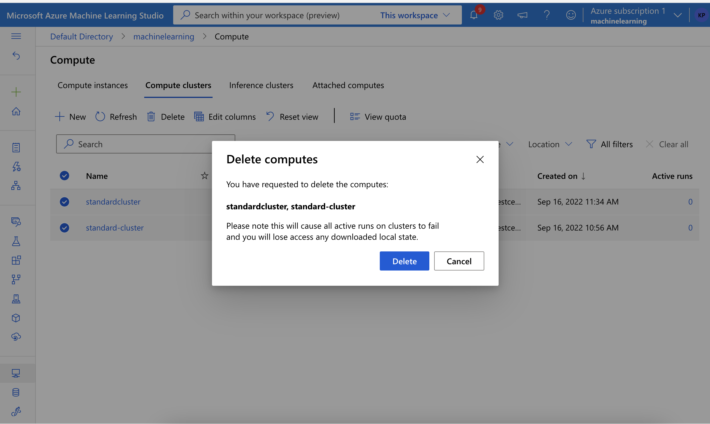
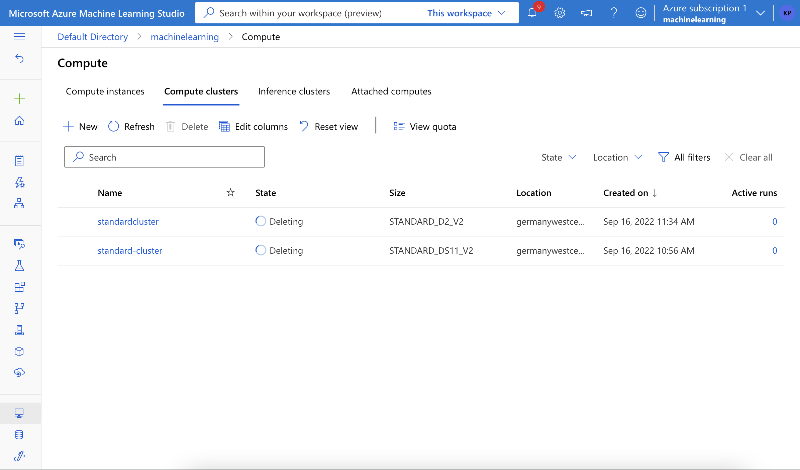

# Optimizing an ML Pipeline in Azure

## Overview
This project is part of the Udacity Azure ML Nanodegree.
In this project, we build and optimize an Azure ML pipeline using the Python SDK and a provided Scikit-learn model.
This model is then compared to an Azure AutoML run.

## Useful Resources
- [ScriptRunConfig Class](https://docs.microsoft.com/en-us/python/api/azureml-core/azureml.core.scriptrunconfig?view=azure-ml-py)
- [Configure and submit training runs](https://docs.microsoft.com/en-us/azure/machine-learning/how-to-set-up-training-targets)
- [HyperDriveConfig Class](https://docs.microsoft.com/en-us/python/api/azureml-train-core/azureml.train.hyperdrive.hyperdriveconfig?view=azure-ml-py)
- [How to tune hyperparamters](https://docs.microsoft.com/en-us/azure/machine-learning/how-to-tune-hyperparameters)

## Summary
**In 1-2 sentences, explain the problem statement: e.g "This dataset contains data about... we seek to predict..."**
The dataset contains around 20 features related to some customers at a bank with a focus on how this data could be used to effectively direct marketing campaigns. The idea is to predict if the customer subscribed for a term deposit or not. The dataset is highly imbalanced with around 90% of the customers not subsrcibed to a term deposit

**In 1-2 sentences, explain the solution: e.g. "The best performing model was a ..."**
The best performing model (0.9180575) was a votingensemble comprising of 8 models with an approximate weight of 0.111 each and one with 0.222 weights
## Scikit-learn Pipeline
**Explain the pipeline architecture, including data, hyperparameter tuning, and classification algorithm.**
Scikit learn pipeline inculded in the first step a function to clean the data, do some feature engineering as well as one hot encoding. The preprocessed data is fed into a Logistic Regression model to build a simple classifier. The hyperparameters of the Logistic Regression model was finetuned using RandomParameterSampling and the best performing parameters were chosen.
**What are the benefits of the parameter sampler you chose?**
RamdomParameterSamping is faster compared to grid search and the results are slightly better than grid search.
**What are the benefits of the early stopping policy you chose?**
Early stopping was done via BanditPolicy. This reduces the computation time by stopping early if the primary metric is not within the range of the slack factor and the best performing run. 
## AutoML
**In 1-2 sentences, describe the model and hyperparameters generated by AutoML.**
Most of the models that were generated by AutoML usually consisted of a scaler and tree based models with the exception of few non-tree based models such as Logistic Regression and SGD. In the end there were a couple of models that focussed on ensembling the models via voting and stacking. The best performing model was a votingensemble that gave a score of around 0.9180575. The voting ensemble consisted of the following models ['LightGBM', 'LightGBM', 'XGBoostClassifier', 'XGBoostClassifier', 'LightGBM', 'XGBoostClassifier', 'XGBoostClassifier', 'SGD'] with a weight of [0.1111111111111111, 0.1111111111111111, 0.1111111111111111, 0.2222222222222222, 0.1111111111111111, 0.1111111111111111, 0.1111111111111111, 0.1111111111111111] respectively. 
## Pipeline comparison
**Compare the two models and their performance. What are the differences in accuracy? In architecture? If there was a difference, why do you think there was one?**
The best performing model from the RandomParameterSampling strategy had an accuracy score of 0.9116240 while the automl came up with a voting ensemble that had an accuracy of 0.9180575. There is a slight improvement in the score. The difference in the architecture is that, in the first case, we just focussed on only one algorithm. However in the AutoML case, different models were tried and at the end an ensemble of 8 different models were used to boost the accuracy. 
## Future work
**What are some areas of improvement for future experiments? Why might these improvements help the model?**
Since the dataset is highly imbalanced, we could think of different methods to overcome either by sampling (under/over) or by giving different weights between the two classes. 
## Proof of cluster clean up
**If you did not delete your compute cluster in the code, please complete this section. Otherwise, delete this section.**
**Image of cluster marked for deletion**

